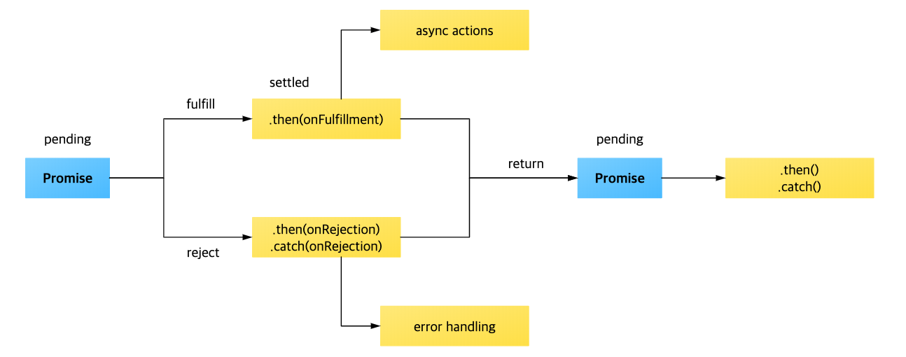

# 프로미스 \| Promise \(ES+\)

## Promise 프로미스 

"A promise is an object that may produce a single value some time in the future"

**프로미스는 자바스크립트 비동기 처리에 사용 되는 객체**입니다. 여기서 비동기 처리란 "**특 코드의 실행이 완료될 때까지 기다리지 않고 다음 코드를 먼저 수행하는 자바스크립트의 특성"**을 의미합니다.

#### 콜백 패턴

```javascript
function getDate(callbackFunc){
    $.get("URL", function(response) {
        callbackFunc(response);
    });
}

getData(function(tableData) {
    console.log(tableData);
});
```

#### 프로미스 패턴

```javascript
function getData(){
    return new Promise(function (resolve, reject) {
        $.get("URL", function(response){
            resolve(response);        
        });
    });
}

// Promise객체는 then()을 호출하면 해당 프로미스 내의 동작이 끝난 후 resolve에 넣은 인자를 반환하는 콜백을 가집다. 
getData().then((tableData) => {
    // resolve()의 결과 값이 여기로 전달됨
    console.log(tableData);
});
```

### 프로미스의 3가지 상태 States

 프로미스를 사용할 때 알아야 하는 가장 기본적인 개념이 바로 **프로미스의 상태\(States\)**입니다. 여기서 말하는 상태란 **프로미스의 처리 과정을 의미**합니다. new Promise\(\)로 프로미스를 생성하고 종료될 때까지 3가지 상태를 갖습니다. 

| 구분  | 설명  |
| :--- | :--- |
| Pending\(대기\) | 비동기 처리 로직이 아직 완료되지 않은 상 |
| Fulfilled\(이행\) | 비동기 처리가 완료되어 프로미스가 결과 값을 반환해준 상태 |
| Rejected\(실패\) | 비동기 처리가 실패하거나 오류가 발생한 상태 |

#### Pending\(대기\)

new Promise\(\) 메서드를 호출하면 **Pending\(대기\) 상태**가 돕니다. 

```javascript
new Promise();
```

이렇게 new Promise\(\) 메서드를 호출할 때 콜백 함수의 인자로 resolve, reject에 접근할 수 있습니다.

```javascript
new Promise((resolve, reject) => {
    // ...
});
```

#### Fulfuilled\(이행\)

 위의 대기 상태에서 콜백 함수의 인자 resolve를 아래와 같이 실행하면 **Fulfilled\(이행\) 상태**가 됩니다. 

```javascript
new Promise((resolve, reject) => {
    resolve()
});
```

그리고 Fulfilled\(이행\) 상태가 되면 then\(\)을 이용해 처리 결과 값을 받을 수 있습니다.

```javascript
getData().then((resolveData)=> {
    console.log(resolveData);
});
```

#### Rejected\(실패\)

 new Promise\(\)로 프로미스 객체를 생성하면 콜백 함수 인자로 resolve와 reject를 사용할 수 있다고 했습니다. 여기서, reject인자로 reject\(\) 메소드를 실행하면 **Rejected\(실패\)상태**가 됩니다.

```javascript
new Promise((resolve, reject) => {
    reject();
});
```

그리고, 실패 상태가 되면 실패한 이유\(실패 처리의 결과 값\)를 catch\(\)로 받을 수 있습니다.

```javascript
getData().then().catch((err) => {
    console.log(err);
});
```



### 프로미스 연결 Promise Chaining

 프로미스의 또 다른 특징은 여러 개의 프로미스를 연결하여 사용할 수 있다는 점입니다. **프로미스는 then\(\) 메서드를 호출하고 나면 새로운 프로미스 객체를 반환**합니다.

```javascript
const promiseChain = new Promise ((resolve,reject) => {
    setTimeout(()=>{
        resolve(1);
    }, 2000);
});

promiseChain
    .then((data) => {
        console.log(data);    // 1
        return data + 10;
    })
    .then((data) => {
        console.log(data);    // 11
        return data + 20;     // 결국 Promise의 resolve와 같음
    })
    .then((data) => {
        console.log(data);    // 31
        ...
    });
        
```

### 프로미스 예외 처리

```javascript
const getData = () => {
    return new Promise((resolve, reject)=>{
        resolve('hi');
    });
}

getData()
.then((result) => {
    console.log(result) // hi
    throw new Error("에러가 발생했습니다.");
})
.catch(err => {
    console.log("Error :" , err); // Error : 에러가 발생했습니다. 
});
```

## 프로미스

 자바스크립트나 Node.js에서 자주 사용하는 콜백 패턴은 비동기적으로 작업을 하는 자바스크립트 언어에서 아주 유용하게 사용하는 패턴입니다. 하지만, 이러한 콜백을 여러번 사용해서 중첩한다면 어떻게 될까요?

```javascript
Post.findOne({...}, (err, post) =>{
    (...)
    post.save((err)=>{
        (...)
        post.findOne({...}, (err)=>{
            (...)
        });
    });
});
```

 이 처럼 코드각 중첩될 때 마다 코드가 안으로 들어가고 중괄호{}와 소괄호\(\)가 반복되는 것을 확인할 수 있습니다. 이런 코드가 기능적으로는 문제가 없지만 프로그래밍이 사람이 하는 일이다 보니 중괄호를 잘 못 써 프로그램이 오류가 나거나 오타가 발생하기도 합니다. 또한, 이런 콜백의 중첩이 반복되면 가독성이 떨어져 같이 협업하는 동료 개발자들의 협업 혹은 유지 보수를 어렵게 만듭니다.

 이런 **콜백의 지옥\(Call Back Hell\)**에서 우리를 구원해주기 위해 ES2015\(ES6\)부터는 **Promise 패턴**을 공식적으로 지원하기 시작했습니다.

### 프로미스 객체 \| Promise Object 

 프로미스는 비동기 작업을 도와주는 객체입니다. `new Promise((resolve, reject)=>{...});`를 통해서 프로미스 객체를 생성할 수 있으며 then, catch를 통해서 에러처리를 담당합니다. 아래 코드를 통해서 프로미스 객체의 사용법을 대략적으로 파악할 수 있습니다.

```javascript
/*프로미스 객체 생성*/
const promise = new Promise((resolve, reject) => {
    try{
        (...비동기 작업)
        resolve(결과값);
    }
    catch(e){
        reject(e);
    }
});

/*프로미스 객체 사용*/
promise.then((result) => {...}).catch((e) => {console.log(e)})

```

 then과 catch에 들어가는 값은 resolve\(결과값\)의 결과값이 then의 result로 넘어가고, reject\(e\)의 에러가 catch의 에러 값으로 넘어갑니다.

### 프로미스 응용 \| Promise.all

 여러 프로미스 객체들을 한번에 모아서 처리할 수 있는 메소드입니다. 이 메소드는 프로미스가 성공하면 then, 하나라도 실패하면 catch로 연결됩니다.

```javascript
/*Promise.all의 예시*/

// new Promise 없이 성공한 Promise 객체를 만드는 방법
let p1 = Promise.resolve('zero'); 
let p2 = Promise.resolve('nero');

// new Promise 없이 실패한 Promise 객체를 만드는 방법
let p3 = Promise.reject('error'); 

// 보통 Promise.all()안에는 배열의 형태로 넣어준다.
Promise.all([p1, p2, p3]).then((result) => {
  console.log(result); 
}).catch((err) => {
  console.error(err)
});
```

### 프로미스 finally \| ES2018

 ES2018 이후 부터는 Promise에 then과 catch 외에도 **finally**가 추가되어 Promise의 성공, 실패 여부와 상관없이 무조건 실행되는 메서드를 추가할 수 있습니다.

```javascript
Promise.resolve("hello World")
    .then((msg) => Promise.resolve(msg))
    .finally(()=>console.log("finally!")
    .then((msg)=> console.log(msg));

// finally! World가 나온다.
```

ES2018 설명을 보면 finally에서 반환\(return\)하는 프로미스는 resolve값을 바꿀 수 없고 reject값만 바꿀 수 있습니다.

