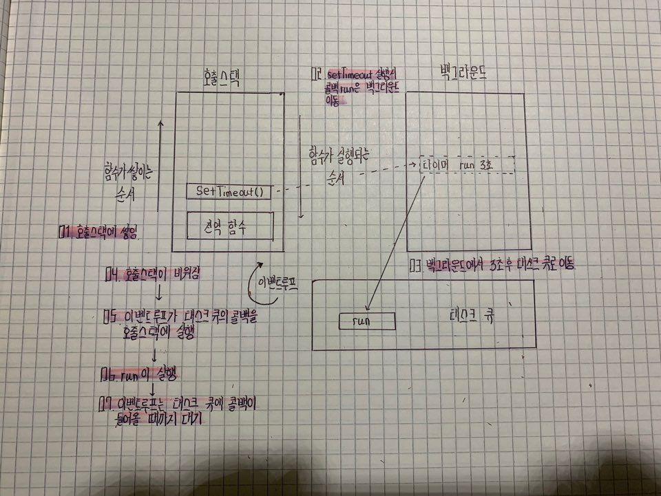

# 이벤트 루프와 호출 스택

## 이벤트 루프와 호출 스택

 자바스크립트의 비동기 처리의 동작 원리를 설명하는 개념입니다.

위와 같은 성질을 통해 setTimeout을 0초를 주어도 비동기 처리를 할 수 있다.

 스택은 자료 구조중 나중에 들어가는 것이 먼저 나오는\(LIFO\) 자료구조를 말합니다.

자바스크립트는 함수를 실행하는 것에 있어 **호출 스택**, **백그라운드** , **태스트 큐**, **이벤트 루프**를 통해서 동작합니다.

### 호출 스택


**Uncaught RangeError: Maximum call stack size exceeded**

위의 에러는 호출 스택이 가득 찼을 때 발생하는 에러입니다. 재귀함수 같이 함수 안에서 계속 다른 함수를 호출하다 보면 다음과 같은 에러가 발생합니다.

호출 스택의 최대치는 보통 1만 개라고 생각하는 것이 편합니다.


### 이벤트 루프

 이벤트 루프는 자바스크립트 동작 원리의 필수적 개념입니다. 자바스크립트의 메인 쓰레드로 싱글 쓰레드입니다. 


**Node와 JS의 setTimeout 지연**

노드와 자바스크립트는 기본적으로 지연을 가집니다.

노드는 1ms의 지연시간을 가지고, JS는 4ms의 지연을 가집니다.


