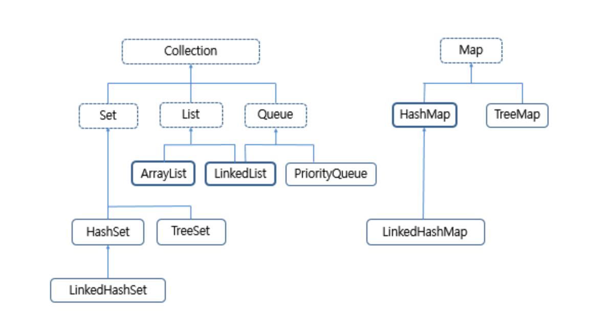

# Map과 Set 객체\(ES6\)

## Map과 Set 객체

 ES6 부터 새로 생긴 객체로 Map은 Object를 변형한 것이고, Set은 Array를 변형한 것입니다. 특정 상황을 위해 사용할 수 있는 객체입니다.

자료구조에서 입력된 키 값을 기준으로 정렬되는 데이터의 집합\(자료 구조\)이다. Map과 Set은 입력된 순서대로 반복적으로 접근 가능한 요소들을 포함하고 있습니다. 


**컬렉션 \| Collection**

**컬렉션은 목록성 데이터를 처리하는 자료구조를 통칭하는 말**입니다. 자료 구조란 어떤 정보를 담는 것을 의미하여, 하나의 데이터가 아닌 여러 데이터를 담을 때 사용하는 방법입니다.


| 구분  | 설명  |
| :--- | :--- |
| List형 | 순서가 있는 데이터의 리스트일 경우 사용하는 자료구조 유형 |
| Set형 | 순서가 중요하지 않고 중복성되지 않는 데이터의 목록인 자료구조 유형  |
| Queue형 | 먼저 들어온 것이 먼저 나가는 자료구조 유형  |
| Map형 | KEY-VALUE의 형태로 저장되는 자료 구조 유형  |



### Map 객체

 Map객체는 Object와 달리 넣은 순서가 기억되고, 키가 문자열이 아니어도 되는 특징을 가집니다. Key-Value형태의 데이터를 처리하기에 특화되어 있습니다.

```javascript
const map = new Map();
map.set('stark','STARK');        // key-value형태로 데이터를 저장합니다.
map.set('taeyun','TAEYUN');
map.size                         // 2
map.has('stark');                // true
map.get('stark');                // STARK
map.entries();                   // {['stark','STARK'],['taeyun','TAEYUN']}
map.keys();                      // {'stark','taeyun'}
map.values();                    // {'STARK','TAEYUN'}
map.delete('stark');             
map.clear();
```

Object에 비해 Map 객체를 사용하면 다음과 같은 장점이 있습니다.

* forEach를 통해 넣은 순서대로 값은 반복 작업합니다
* 키가 문자열 뿐만 아니라 어떤 값이어도 상관없다\(객체도 가능\)
* size를 체크할 수 있다.
* 다양한 편리한 메소드가 있다.

### Set 객체

 set은 Array와 비슷합니다. set은 값이 중복될 수 없다는 특징을 가지고있습니다. 즉, 데이터의 중복이 없어야하는 데이터를 다룰 때 사용할 수 있습니다. 

```javascript
const set = new Set();
set.add('stark');
set.add('taeyun');
set.has('stark');            // true
set.size;                    // 2
set.entries();               // {['stark','stark'],['taeyun','taeyun]}
set.keys();                  // {'stark','taeyun'}
set.values();                // {'stark','taeyun'}
set.delete('stark');
set.clear();
```

Array에 비해 set은 다음과 같은 특징이 있습니다. _**set은 중복되지 않게 값을 넣어두고 반복하는 작업에 사용**_됩니다.

* 중복이 불가능 합니다.
* 중간 값 확인이 불가능합니다.
* 편리한 메소드를 제공합니다. 

forEach를 이용해서 set객체를 반복할 수 있습니다. 이때 forEach는 다음 3가지 인자를 반환합니다.

* value = 값 자체 
* key = 키\(인덱스\)
* s = 반복하고 있는 배열

이를 통해 값에 순차적으로 접근할 수 있습니다.


**가비지 컬렉션 \|  Garbage Collection**

메모리 관리 기법 중의 하나, 프로그램이 동적으로 할당 했던 메모리 영역 중에서 필요 없게 된 영역을 해제하는 기능이다. 

동적 할당된 메모리 영역 가운데 더 이상 사용할 수 없게 된 영역을 탐지하여 자동으로 해제하는 기법이다. 더 이상 사용할 수 없게 된 영역이란, 어떤 변수도 가리키지 않게 된 영역을 말한다. 


### weakMap 과 weakSet

#### weakMap

 weakMap은 KEY값으로 객체를 가지는 Map입니다. 

* entries, keys, values를 사용할 수 없습니다.

#### weakSet

weakSet은 객체만을 값으로 받는 Set입니다.

* entries, keys, values를 사용할 수 없습니다. 

