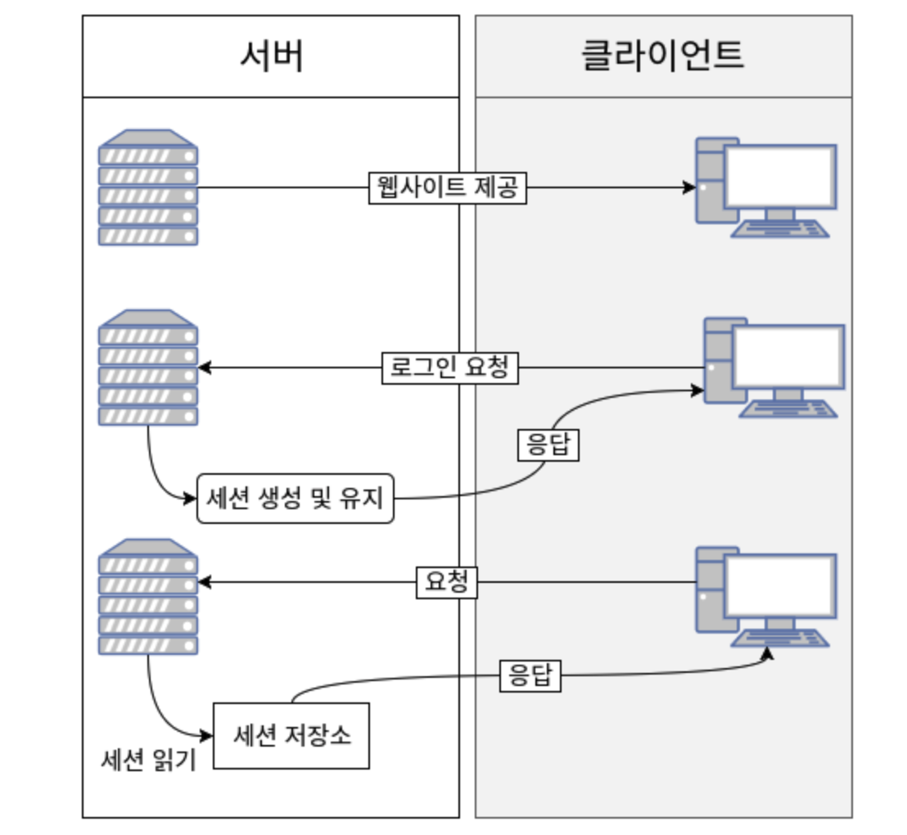
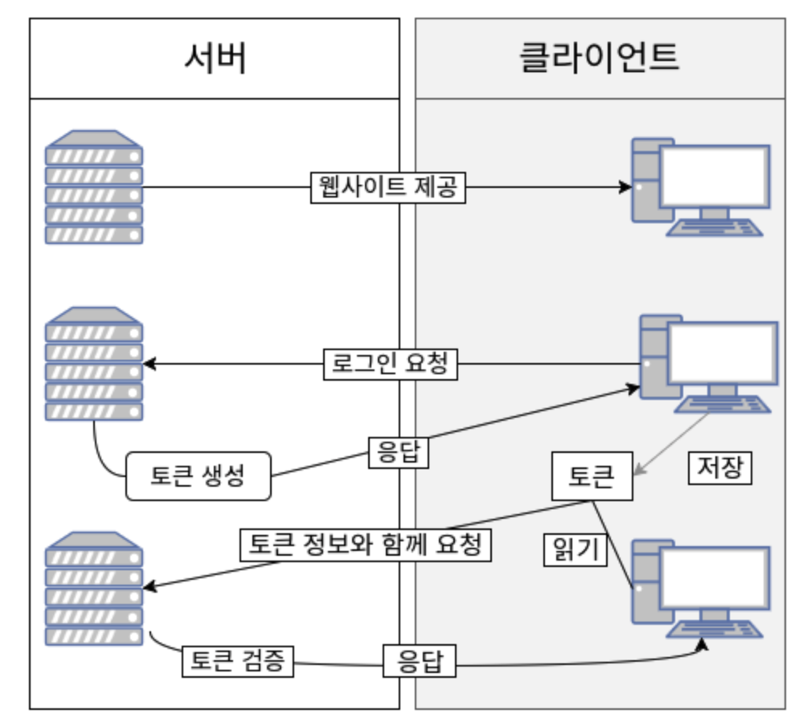

# 토큰 기반 인증 \| Token

## 토큰 \| Token

 **토큰\(Token\) 기반 인증은 모던 웹 서비스에서 정말 많이 사용되고 있는 방식**입니다. API를 통한 웹 서버 개발 시 토큰을 사용하여 유저들의 인증 작업을 처리하는 것이 가장 좋은 방법입니다. 

### 토큰 기반 인증 시스템 사용 이유

#### Stateless 서버

 클라이언트에게서 요청을 받을 때 마다 클라이언트의 상태를 계속해서 유지하고, 이 정보를 서비스 제공에 이용하는 서버를 **Stateful서버**라고 합니다. 즉, **유저가 웹 서버에 로그인을 하면 세션에 저장하고 서버에 해당 데이터를 저장\(데이터 베이스, 메모리 등등\)하는 방식**입니다.

 반, **Stateless 서버는 상태를 유지하지 않습니다.** 서버는 클라이언트 측에서 들어오는 요청만으로 작업을 처리합니다. 이렇게 상태가 없는 경우 클라이언트와 서버의 연결고리가 없기 때문에 **서버의 확장성\(Scalability\)가 높아집니다**.


**웹 서버의 확장성\(Scalability\)**

 만약 메모리에 세션 정보\(로그인 정보\)를 관리할 경우 단일 서버에 대해서는 정상적으로 동작하지만, 여러 대의 서버에 대해서는 메모리를 공유할 수 없어 요청이 다른 서버로 넘어 갈 경우 로그인 정보를 인식하지 못합니다. 

이를 방지하기 위해 Redis에 세션정보를 보관하는 등 다양한 방법이 생겼습니다.  


#### 모바일 퍼스트 \| Mobile First

 만약 Android/IOS 모바일 어플리케이션을 개발 한다면, 안전한 API를 만들기 위해 쿠키와 같은 인증 시스템은 이상적이지 않습니다. 왜냐하면 **쿠키 컨테이너와 같은 별도의 시스템을 도입**해야하기 때문입니다.

 하지만, **토큰 기반 인증을 도입한다면 더욱 간단하게 번거로움을 해결**할 수 있습니다.

#### 타사 인증 

OAuth등을 이용해 타사 인증을 할 때 유용합니다. 

#### 보안

 토큰 기반 인증 시스템을 사용하여 **어플리케이션의 보안을 높일 수 있습니다**. 단, 위험이 없는 것은 아닙니다. 

### 서버 기반 인증

 기존의 인증 시스템은 서버측에서 유저들의 정보를 기억해야 했습니다. 이런 세션을 유지하기 위해 **메모리\(Session Storage\)**/ **디스크**/ **데이터베이스\(Redis\)**에 이를 담곤 했습니다. 

 해당 방식을 아직 사용하고 있지만, 최근 웹+모바일 웹 어플리케이션의 트렌드가 지속되면서 **서버 확장이 어렵다는 문제**가 발생하게 되었습니다. 

* 세션 공유가 불가능하여 단일 서버에서는 유용하지만, 다수의 서버에 대해서 문제 발생
* 데이터베이스\(Redis\)에 저장한다 해도 요청이 많아지면 데이터베이스에 무리가 생김

### 토큰 기반 시스템

 토큰 기반 시스템은 **무상태입니다**. 따라서, 유저의 인증 정보를 서버에 보관하지 않습니다. **무상태이기 때문에 확장이 용이**합니다. 

**웹 서버에서 토큰을 서버에 전달할 때  HTTP 요청의 헤더에 토큰 값을 포함시켜서 전달**합니다. 

