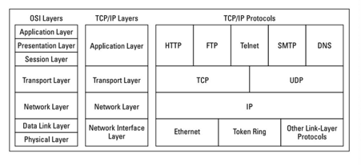

# HTTP 통신

## HTTP \| HyperText Transfer Protocol

 인터넷에서 웹 서버와 사용자의 인터넷 브라우저 사이에 문서를 전송하기 위해 사용하는 통신 규약을 HTTP라고 한다. HTTP는 **80번 포트**를 사용하도록 정의되어 있다.

 HTTP서버로 부터 웹 정보를 얻기 위해서는 http://www.도메인.co.kr과 같이 URL 주소에 HTTP를 사용한다고 명시해야 한다. 

 이와 마찬가지로 FTP를 이용해서 서버에 접근하기 위해서는 ftp://www.도메인.co.kr로 텔넷\(Telnet\)을 이용하려면 telnet://www.도메인.co.kr로 주소를 명시해야 한다.

 HTTP는 Request\(요청\)과 Response\(응답\)으로 이루어진 통신 프로토콜이다. 


\*\*\*\*[**HTTP와 HTTPs**](https://ko.wikipedia.org/wiki/HTTPS)\*\*\*\*

https로 접속하기 위해서는 별도의 도메인과 인증서 발급이 필요합니다. HTTP 프로토콜에 보안을 강화하기 위해 인증과 암호화를 추가한 프로토콜이다.

HyperText Protocol over Secure Socket Layer의 약자로 HTTPS는 소켓 통신에서 일반 텍스트를 사용하는 대신에, SSL이나 TLS프로콜을을 통해 세션 데이터를 암호화한다. 따라서 데이터의 적절한 보호를 보장한다. 

HTTPS의 기본 TCP/IP포트는 443이다. 


