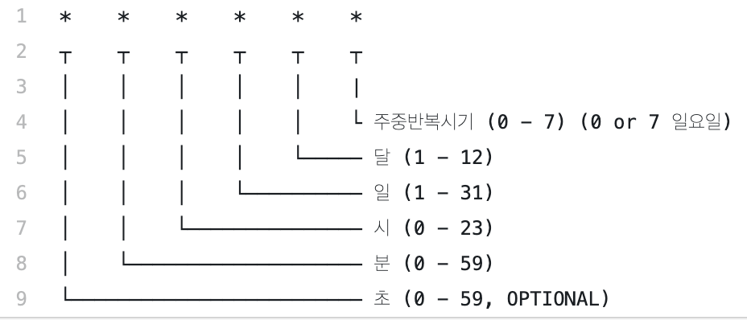

# 스케줄링 구현

## 스케줄링 Scheduling

 비즈니스 로직을 만들다 보면, 반드시 특정 시간이나 일정 시간 후에 원하는 동작을 수행해야하는 경우가 생깁니다. node는 이러한 스케줄링을 지원하는 node-schedule 패키지가 존재합니다. 

```bash
$npm i node-schedule
```

 **node-schedule 패키지**는 위와 같이 설치할 수 있습니다. 

### 스케줄링 구현 

 node-schedule은 다음과 같이 사용할 수 있습니다. 

```javascript
...
const scheduler = require("node-schedule");
...
const end = new Date();
end.setDate(end.getDate() + 1); // 하루 뒤 
scheduler.scheduleJob(end(실행되어야 할 날짜), async()=> {
    ...수행해야 할 함수
});
```

 scheduler 객체의 scheduleJob 메서드를 통해 일정을 예약할  수 있습니다. 첫 번째 인자에 실행될 시각을 넣고, 두 번째 인자로 해당 시각이 되었을 대 수행할 콜백 함수를 넣습니다. 

 node-schedule 패키지는 **Cron-Style의 시간 설정**을 사용해서 설정 할 수 있어 아래와 같은 구현이 쉽게 됩니다. 



```javascript
const schedule = require('node-schedule'); 
const scheduler = schedule.scheduleJob('00 * * * *',()=>{ 
    //logic(); 
    console.log('정시!'); 
});
```

```javascript
const schedule = require('node-schedule'); 
const scheduler = schedule.scheduleJob('0/5 * * * *',()=>{ 
    //logic(); 
    console.log('5분 마'); 
});
```

