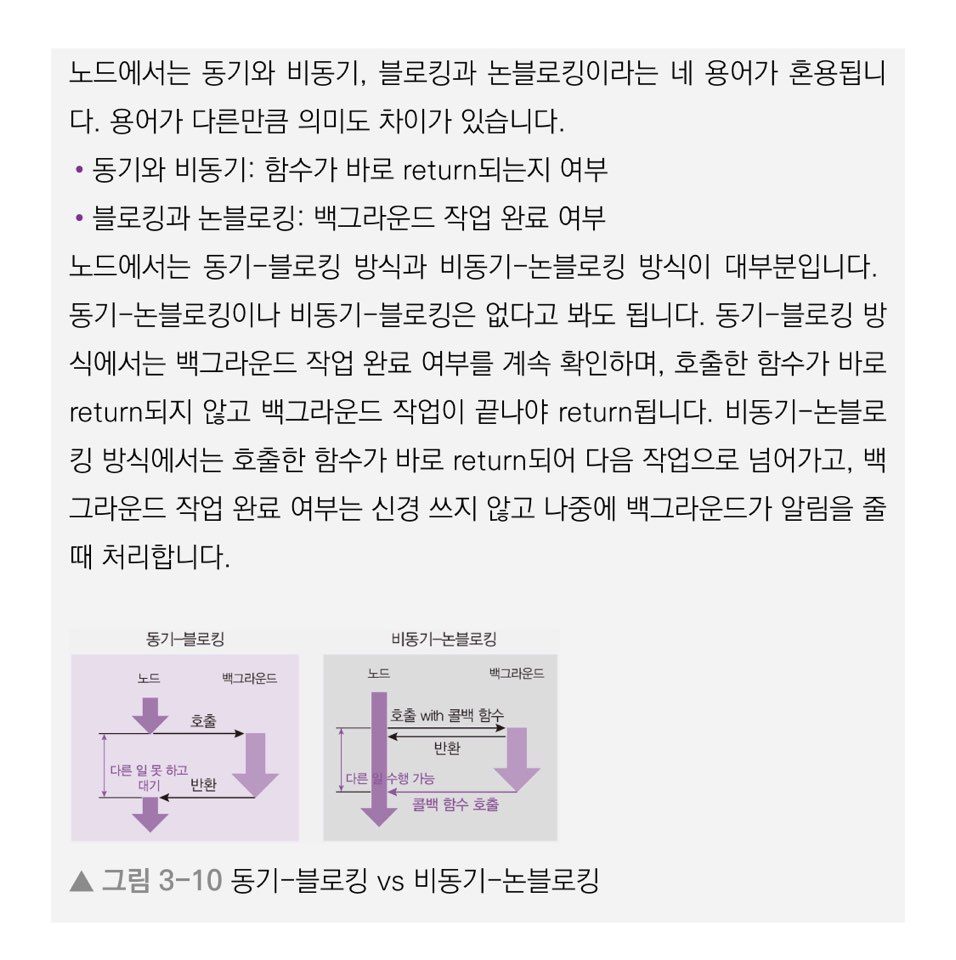

# 노드 파일 시스템 처리

## 노드 파일 시스템 처리 File System

### 기본적인 파일 읽기/쓰기

#### 파일 읽기 

 노드는 fs모듈을 이용해 파일 시스템에 접근할 수 있습니다. 즉, 파일을 생성하거나 삭제하고, 읽거나 쓸 수 있습니다. 

```javascript
const fs = require("fs");

fs.readFile("./readme.txt", (error, data) => {
    if(error){
        throw error;
    }
    console.log(data);
    console.log(data.toString());
}
```

 readFile은 데이터를 버퍼 형식으로 제공하기에 반드시 toString\(\)을 해주어야 원하는 결과를 얻을 수 있습니다. 

#### 파일 쓰기 

```javascript
const fs = require("fs");

fs.writeFile("./writeme.txt","글이 입력됩니다.', (error) => {
    if(error){
        throw error;
    }
    fs.readFile("./writeme.text", (error, data) =>{
        if(error){
            throw error;
        }
        console.log(data.toString());
    });
});
```

### 동기 메서드와 비동기 메서드 



 동기 - 블로킹 방식과 비동기 - 논블로킹 방식을 이해하는 것이 노드를 이해하는데 중요한 역할을 합니다. 

| 구분  | 설명  |
| :--- | :--- |
| **fs.readFileSync\(\)** | 파일을 읽는 동기 - 블로킹 방식으로 진행하는 메소드  |
| **fs.writeFileSync\(\)** | 파일을 쓰는 동기 - 블로킹 방식으로 진행하는 메소드   |

Sync\(동기\) 메소드를 사용할 경우 요청이 수백 개 이상 들어왔을 때 성능에 문제가 생깁니다.

 백그라운드각 작업을 하는 동안 메인 스레드는 아무것도 못하고 대기 해야 하기에 메인 스레드가 일을 하지 않고 노는 시간이 생기기 때문에 비효율적입니다.

### 버퍼와 스트림 Buffer and Stream

 파일을 일거나 쓰는 방식에는 **버퍼를 이용하는 방식**과 **스트림을 이용하는 방식** 크게 두 가지가 있습니다. 

| 구분  | 설명  |
| :--- | :--- |
| **버퍼링 Buffering**  | 영상을 재생할 수 있을 때까지 데이터를 모으는 동작 |
| **스트리밍 Streaming** | 영상 데이터를 조금씩 전송하는 방식의 동작  |

**노드는 파일을 읽을 때 메모리에 파일 크기 만큼 공간을 마련해두며, 파일 데이터를 메모리에 저장한 뒤 사용자가 조작할 수 있도록 해줍니다.** 메모리에 저장된 데이터가 바로 버퍼입니다. 

#### Buffer 클래스

```javascript
const buffer = Buffer.from("저를 버퍼로 바꿔보세요.");
console.log("from():", buffer);
console.log("length:", buffer.length);    // length: 32
console.log("toString():", buffer.toString()); // toString(): 저를 버퍼로 바꿔보세요

const array = [Buffer.from("띄엄"), Buffer.from("띄엄"), Buffer.from("띄어쓰기")];
const buffer2 = Buffer.concat(array);
console.log("concat():", buffer2.toString()); // concat() 띄엄 띄엄 띄어쓰

```

 Buffer 객체는 여러 가지 메서드를 제공합니다. 

| 구분  | 설명  |
| :--- | :--- |
| buffer.from\(문자열\) | 문자열을 버퍼로 바꿀 수 있습니다.  length 속성은 버퍼의 크기를 바이트 단위로 알려줍니다. |
| buffer.toString\(버퍼\) | 버퍼를 다시 문자열로 바꿀 수 있습니다. 이때 base64나 hex를 인자로 넣으면 해당 인코딩으로도 변환할 수 있습니다.  |
| buffer.concat\(배열\) | 배열 안에 든 버퍼들을 하나로 합칩니다. |
| buffer.alloc\(바이트\) | 빈 버퍼를 생성합니다. 바이트를 인자로 지정해주면 해당 크기의 버퍼가 생성됩니다. |

 버퍼를 사용할 경우 다음과 같은 문제가 발생합니다. 

* 용량이 큰 파일이 있을 때 메모리에 그 만큼의 버퍼를 만들어야 합니다. 서버와 같이 수 백만 명이 이용할지 모르는 환경에서는 **메모리 문제**가 발생할 수 있습니다.
* 모든 내용을 버퍼에 다 쓴 후에야 다음 동작으로 넘어가므로 파일 읽기, 압축, 파일 쓰기 등의 조작을 연달아 할 때 매번 전체 용량을 버퍼로 처리해야 다음 단계로 넘어갈 수 있습니다. 

  위와 같은 문제를 보완하기 위해 버퍼의 크기를 작게 만들어서 여러 번에 나눠서 보내는 방식이 등장했습니다. 파일을 읽는 스트림 메서드로는 createReadStream이 있습니다. 

#### Stream 메서드

```javascript
const fs = require("fs");

const writeStream = fs.createWriteStream('./writeme2.txt');
writeStream.on('finish', () => {
    console.log('파일 쓰기 완료');
});

writeStream.write("이 글을 씁니다.\n");
writeStream.write("한 번 더 씁니다.");
writeStream.end();

```

| 구분  | 설명  |
| :--- | :--- |
| writeStream.write\(\) | 글을 쓸 데이터를 넣어주며 여러 번 호출할 수 있습니다. |
| writeStream.end\(\) | 데이터를 다 썼다는 것을 알려주는 메서드입니다. 이때 finish 이벤트가 발생합니다.  |

```javascript
const  fs = require("fs");

const readStream = fs.createReadStream("readme4.txt");
const writeStream = fs.createWriteStream("writeme3.txt");
readStream.pipe(writeStream);
```

<table>
  <thead>
    <tr>
      <th style="text-align:left">&#xAD6C;&#xBD84;</th>
      <th style="text-align:left">&#xC124;&#xBA85;</th>
    </tr>
  </thead>
  <tbody>
    <tr>
      <td style="text-align:left">readStream.pipe()</td>
      <td style="text-align:left">
        <p>&#xD30C;&#xC77C; &#xBCF5;&#xC0AC;&#xC640; &#xBE44;&#xC2B7;&#xD55C; &#xAC1C;&#xB150;&#xC73C;&#xB85C;
          &#xC2A4;&#xD2B8;&#xB9BC; &#xB07C;&#xB9AC; &#xC5F0;&#xACB0;&#xD558;&#xC5EC;
          &#xD30C;&#xC774;&#xD551;&#xD558;&#xB294; &#xBA54;&#xC18C;&#xB4DC;&#xC785;&#xB2C8;&#xB2E4;.</p>
        <p>&#xC774;&#xB807;&#xAC8C; &#xC5F0;&#xACB0;&#xD574;&#xC8FC;&#xBA74; &#xB370;&#xC774;&#xD130;&#xAC00;
          &#xC790;&#xB3D9;&#xC73C;&#xB85C; &#xB118;&#xC5B4;&#xAC11;&#xB2C8;&#xB2E4;.</p>
      </td>
    </tr>
  </tbody>
</table>#### gzip 압축 라이브러리 

 노드에서는 파일 압축하는 zlib라는 모듈을 제공합니다. 

```javascript
const zlib = require("zlib");
const fs = require("fs");

const readStream = fs.createReadStream("./readme4.txt");
const zlibStream = zlib.createGzip();
const writeStream = fs.createWriteStream("./readme4.txt.gz");
readStream.pipe(zlibStream).pipe(writeStream);
```

zlib의 createGzip\(\) 메서드는 스트림을 지원하여 readStream과 writeStream 중간에서 파이핑을 할 수 있습니다. 버퍼 데이터가 전달되다가 gzip 압축을 거친 후 파일로 쓰여집니다. 

### 기타 fs 메서드

 fs는 파일 시스템을 조작하는 다양한 메서드를 제공합니다. 

지금까지는 단순히 파일 읽기/쓰기를 했지만, 파일을 생성하고 삭제할 수도 있고, 폴더를 생성하고 삭제할 수도 있습니다. 

<table>
  <thead>
    <tr>
      <th style="text-align:left">&#xAD6C;&#xBD84;</th>
      <th style="text-align:left">&#xC124;&#xBA85;</th>
    </tr>
  </thead>
  <tbody>
    <tr>
      <td style="text-align:left">fs.access(&#xACBD;&#xB85C;, &#xC635;&#xC158;, &#xCF5C;&#xBC31;)</td>
      <td
      style="text-align:left">
        <p>&#xD3F4;&#xB354;&#xB098; &#xD30C;&#xC77C;&#xC5D0; &#xC811;&#xADFC;&#xD560;
          &#xC218; &#xC788;&#xB294;&#xC9C0;&#xB97C; &#xCCB4;&#xD06C;&#xD569;&#xB2C8;&#xB2E4;.
          &#xB450;&#xBC88;&#xC9F8; &#xC778;&#xC790;&#xB85C; &#xC0C1;&#xC218;&#xB4E4;&#xC744;
          &#xB123;&#xC74C;.</p>
        <p>F_OK&#xB294; &#xD30C;&#xC77C; &#xC874;&#xC7AC; &#xC5EC;&#xBD80;, R_OK&#xB294;
          &#xC77D;&#xAE30; &#xAD8C;&#xD55C; &#xC5EC;&#xBD80;, W_OK&#xB294; &#xC4F0;&#xAE30;
          &#xAD8C;&#xD55C; &#xC5EC;&#xBD80; &#xCCB4;&#xD06C;</p>
        </td>
    </tr>
    <tr>
      <td style="text-align:left">fs.mkdir(&#xACBD;&#xB85C;, &#xCF5C;&#xBC31;)</td>
      <td style="text-align:left">&#xD3F4;&#xB354;&#xB97C; &#xB9CC;&#xB4DC;&#xB294; &#xBA54;&#xC11C;&#xB4DC;&#xC785;&#xB2C8;&#xB2E4;.
        &#xC774;&#xBBF8; &#xD3F4;&#xB354;&#xAC00; &#xC788;&#xB2E4;&#xBA74; &#xC5D0;&#xB7EC;&#xAC00;
        &#xBC1C;&#xC0DD;&#xD558;&#xBBC0;&#xB85C; &#xBA3C;&#xC800; access() &#xBA54;&#xC11C;&#xB4DC;&#xB97C;
        &#xD638;&#xCD9C;&#xD574;&#xC11C; &#xD655;&#xC778;&#xD558;&#xB294; &#xAC83;&#xC774;
        &#xC911;&#xC694;&#xD569;&#xB2C8;&#xB2E4;.</td>
    </tr>
    <tr>
      <td style="text-align:left">fs.open(&#xACBD;&#xB85C;, &#xC635;&#xC158;, &#xCF5C;&#xBC31;)</td>
      <td
      style="text-align:left">&#xD30C;&#xC77C;&#xC758; &#xC544;&#xC774;&#xB514;&#xB97C; &#xAC00;&#xC838;&#xC624;&#xB294;
        &#xBA54;&#xC11C;&#xB4DC;&#xC785;&#xB2C8;&#xB2E4;. &#xD30C;&#xC77C;&#xC774;
        &#xC5C6;&#xB2E4;&#xBA74; &#xD30C;&#xC77C;&#xC744; &#xC0DD;&#xC131;&#xD55C;
        &#xB4A4; &#xADF8; &#xC544;&#xC774;&#xB514;&#xB97C; &#xAC00;&#xC838;&#xC635;&#xB2C8;&#xB2E4;.
        &#xAC00;&#xC838;&#xC628; &#xC544;&#xC774;&#xB514;&#xB97C; &#xC0AC;&#xC6A9;&#xD574;
        fs.read()&#xB098; fs.write()&#xB85C; &#xC77D;&#xAC70;&#xB098; &#xC4F8;
        &#xC218; &#xC788;&#xC2B5;&#xB2C8;&#xB2E4;.</td>
    </tr>
    <tr>
      <td style="text-align:left">fs.rename(&#xAE30;&#xC874; &#xACBD;&#xB85C;, &#xC0C8; &#xACBD;&#xB85C;,
        &#xCF5C;&#xBC31;)</td>
      <td style="text-align:left">&#xD30C;&#xC77C;&#xC758; &#xC774;&#xB984;&#xC744; &#xBC14;&#xAFB8;&#xB294;
        &#xBA54;&#xC18C;&#xB4DC;&#xC785;&#xB2C8;&#xB2E4;. &#xAE30;&#xC874; &#xD30C;&#xC77C;
        &#xC704;&#xCE58;&#xC640; &#xC0C8;&#xB85C;&#xC6B4; &#xD30C;&#xC77C; &#xC704;&#xCE58;&#xB97C;
        &#xC801;&#xC5B4;&#xC8FC;&#xBA74;&#xB429;&#xB2C8;&#xB2E4;.</td>
    </tr>
    <tr>
      <td style="text-align:left">fs.readdir(&#xACBD;&#xB85C;, &#xCF5C;&#xBC31;)</td>
      <td style="text-align:left">&#xD3F4;&#xB354; &#xC548;&#xC758; &#xB0B4;&#xC6A9;&#xBB3C;&#xC744; &#xD655;&#xC778;&#xD560;
        &#xC218; &#xC788;&#xC73C;&#xBA70; &#xBC30;&#xC5F4;&#xD615;&#xD0DC;&#xB85C;
        &#xAC12;&#xC744; &#xBC18;&#xD658;&#xD569;&#xB2C8;&#xB2E4;.</td>
    </tr>
    <tr>
      <td style="text-align:left">fs.unlink(&#xACBD;&#xB85C;, &#xCF5C;&#xBC31;)</td>
      <td style="text-align:left">&#xD30C;&#xC77C;&#xC744; &#xC9C0;&#xC6B8; &#xC218; &#xC788;&#xC2B5;&#xB2C8;&#xB2E4;.
        &#xD30C;&#xC77C;&#xC774; &#xC5C6;&#xB2E4;&#xBA74; &#xC5D0;&#xB7EC;&#xAC00;
        &#xBC1C;&#xC0DD;&#xD574; &#xD30C;&#xC77C; &#xC5EC;&#xBD80;&#xB97C; &#xD655;&#xC778;&#xD558;&#xB294;
        &#xAC83;&#xC774; &#xC911;&#xC694;&#xD569;&#xB2C8;&#xB2E4;.</td>
    </tr>
    <tr>
      <td style="text-align:left">fs.rmdir(&#xACBD;&#xB85C;, &#xCF5C;&#xBC31;)</td>
      <td style="text-align:left">&#xD3F4;&#xB354;&#xB97C; &#xC9C0;&#xC6B8; &#xC218; &#xC788;&#xC2B5;&#xB2C8;&#xB2E4;.
        &#xD3F4;&#xB354; &#xC548;&#xC5D0; &#xD30C;&#xC77C;&#xC774; &#xC788;&#xB2E4;&#xBA74;
        &#xC5D0;&#xB7EC;&#xAC00; &#xBC1C;&#xC0DD;&#xD558;&#xBBC0;&#xB85C; &#xBA3C;&#xC800;
        &#xB0B4;&#xBD80; &#xD30C;&#xC77C;&#xC744; &#xBAA8;&#xB450; &#xC9C0;&#xC6B0;&#xACE0;
        &#xD638;&#xCD9C;&#xD574;&#xC57C;&#xD569;&#xB2C8;&#xB2E4;.</td>
    </tr>
  </tbody>
</table>

