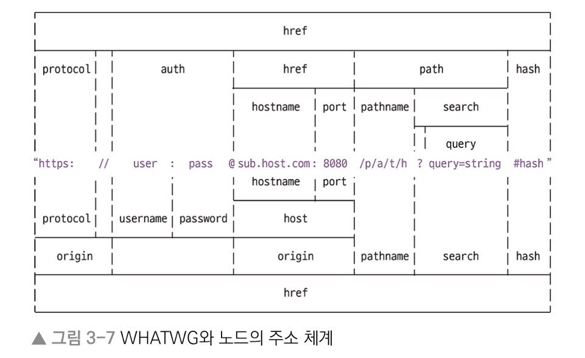

# 노드 내장 모듈

## 노드 내장 모듈 Built-in Module

 노드는 운영체제 정보에도 접근할 수 있고, 클라이언트가 요청한 주소에 대한 정보도 가져올 수 있는 등 다양한 기능을 제공합니다. 대표적으로 자주  사용하는 노드 모듈에 대해 알아봅시다. 

###  OS 모듈

 **운영체제에 대한 정보를 반환하는 내장 모듈**입니다. 다음과 같이 사용할 수 있습니다 .

```javascript
const os = require("os");

console.log("os.type() : ", os.type());
```

<table>
  <thead>
    <tr>
      <th style="text-align:left">&#xAD6C;&#xBD84;</th>
      <th style="text-align:left">&#xC124;&#xBA85;</th>
    </tr>
  </thead>
  <tbody>
    <tr>
      <td style="text-align:left"><b>os.arch()</b>
      </td>
      <td style="text-align:left">&#xB178;&#xB4DC; &#xC2E4;&#xD589; &#xD658;&#xACBD;&#xC758; &#xD504;&#xB85C;&#xC138;&#xC2A4;
        &#xC544;&#xD0A4;&#xD14D;&#xCCD0;&#xB97C; &#xBC18;&#xD658;&#xD569;&#xB2C8;&#xB2E4;.</td>
    </tr>
    <tr>
      <td style="text-align:left"><b>os.platform() </b>
      </td>
      <td style="text-align:left">&#xB178;&#xB4DC; &#xC2E4;&#xD589; &#xD658;&#xACBD;&#xC758; &#xD504;&#xB85C;&#xC138;&#xC2A4;
        &#xC6B4;&#xC601;&#xCCB4;&#xC81C;&#xB97C; &#xBC18;&#xD658;&#xD569;&#xB2C8;&#xB2E4;.</td>
    </tr>
    <tr>
      <td style="text-align:left"><b>os.type() </b>
      </td>
      <td style="text-align:left">&#xC6B4;&#xC601; &#xCCB4;&#xC81C;&#xC758; &#xC885;&#xB958;&#xB97C; &#xBC18;&#xD658;&#xD569;&#xB2C8;&#xB2E4;.</td>
    </tr>
    <tr>
      <td style="text-align:left"><b>os.uptime()</b>
      </td>
      <td style="text-align:left">
        <p>&#xC6B4;&#xC601;&#xCCB4;&#xC81C; &#xBD80;&#xD305; &#xC774;&#xD6C4; &#xD750;&#xB978;
          &#xC2DC;&#xAC04;(&#xCD08;)&#xC744; &#xBC18;&#xD658;&#xD569;&#xB2C8;&#xB2E4;.</p>
        <p>process.uptime()&#xC740; &#xB178;&#xB4DC; &#xC2E4;&#xD589;&#xC2DC;&#xAC04;
          &#xC785;&#xB2C8;&#xB2E4;.</p>
      </td>
    </tr>
    <tr>
      <td style="text-align:left"><b>os.hostname()</b>
      </td>
      <td style="text-align:left">&#xCEF4;&#xD4E8;&#xD130;&#xC758; &#xC774;&#xB984;&#xC744; &#xBC18;&#xD658;&#xD569;&#xB2C8;&#xB2E4;.</td>
    </tr>
    <tr>
      <td style="text-align:left"><b>os.release() </b>
      </td>
      <td style="text-align:left">&#xC6B4;&#xC601;&#xCCB4;&#xC81C;&#xC758; &#xBC84;&#xC804;&#xC744; &#xBC18;&#xD658;&#xD569;&#xB2C8;&#xB2E4;.</td>
    </tr>
    <tr>
      <td style="text-align:left"><b>os.homedir()</b>
      </td>
      <td style="text-align:left">&#xD648; &#xB514;&#xB809;&#xD1A0;&#xB9AC; &#xACBD;&#xB85C;&#xB97C; &#xBC18;&#xD658;&#xD569;&#xB2C8;&#xB2E4;.</td>
    </tr>
    <tr>
      <td style="text-align:left"><b>os.tmpdir()</b>
      </td>
      <td style="text-align:left">&#xC784;&#xC2DC; &#xD30C;&#xC77C; &#xC800;&#xC7A5; &#xACBD;&#xB85C;&#xB97C;
        &#xBC18;&#xD658;&#xD569;&#xB2C8;&#xB2E4;.</td>
    </tr>
    <tr>
      <td style="text-align:left"><b>os.cpus()</b>
      </td>
      <td style="text-align:left">
        <p>&#xCEF4;&#xD4E8;&#xD130;&#xC758; &#xCF54;&#xC5B4; &#xC815;&#xBCF4;&#xB97C;
          &#xBC18;&#xD658;&#xD569;&#xB2C8;&#xB2E4;.</p>
        <p>- os.cpus().length&#xB97C; &#xD1B5;&#xD574; &#xCF54;&#xC5B4; &#xAC1C;&#xC218;&#xB97C;
          &#xD655;&#xC774;&#xB2C8;&#xD560; &#xC218; &#xC788;&#xC2B5;&#xB2C8;&#xB2E4;.</p>
      </td>
    </tr>
    <tr>
      <td style="text-align:left"><b>os.freemem()</b>
      </td>
      <td style="text-align:left">&#xC0AC;&#xC6A9; &#xAC00;&#xB2A5;&#xD55C; &#xBA54;&#xBAA8;&#xB9AC;(RAM)&#xC744;
        &#xBC18;&#xD658;&#xD569;&#xB2C8;&#xB2E4;.</td>
    </tr>
    <tr>
      <td style="text-align:left"><b>os.totalmem()</b>
      </td>
      <td style="text-align:left">&#xC804;&#xCCB4; &#xBA54;&#xBAA8;&#xB9AC; &#xC6A9;&#xB7C9;&#xC744; &#xBC18;&#xD658;&#xD569;&#xB2C8;&#xB2E4;.</td>
    </tr>
    <tr>
      <td style="text-align:left"><b>os.constants</b>
      </td>
      <td style="text-align:left">&#xAC01; &#xC885; &#xC5D0;&#xB7EC;&#xC640; &#xC2E0;&#xD638;&#xC5D0; &#xB300;&#xD55C;
        &#xC815;&#xBCF4;&#xB97C; &#xBC18;&#xD658;&#xD569;&#xB2C8;&#xB2E4;.</td>
    </tr>
  </tbody>
</table>### path 모듈

 **폴더와 파일의 경로를 쉽게 조작하도록 도와주는 내장 모듈**입니다. 운영 체제 별로 경로 구분자가 다르기 때문에  path 모듈을 사용해 파일명과 확장자만 따로 떼어주는 등을 쉽게 구현할 수 있습니다. 


**window는 \\(역슬래쉬\)**로 경로를 구분하고  
**유닉스 기반\(POSIX\)은 /\(슬래쉬\)**로 경로를 구분합니다. 


 path 모듈의 기능은 다음과 같습니다. 

<table>
  <thead>
    <tr>
      <th style="text-align:left">&#xAD6C;&#xBD84;</th>
      <th style="text-align:left">&#xC124;&#xBA85;</th>
    </tr>
  </thead>
  <tbody>
    <tr>
      <td style="text-align:left"><b>path.sep</b>
      </td>
      <td style="text-align:left">&#xACBD;&#xB85C;&#xC758; &#xAD6C;&#xBD84;&#xC790;&#xB97C; &#xBC18;&#xD658;&#xD569;&#xB2C8;&#xB2E4;.</td>
    </tr>
    <tr>
      <td style="text-align:left"><b>path.delimiter</b>
      </td>
      <td style="text-align:left">
        <p>&#xD658;&#xACBD; &#xBCC0;&#xC218;&#xC758; &#xAD6C;&#xBD84;&#xC790;&#xB97C;
          &#xBC18;&#xD658;&#xD569;&#xB2C8;&#xB2E4;.</p>
        <p>process.env.PATH&#xB97C; &#xC785;&#xB824;&#xD558;&#xBA74; &#xC5EC;&#xB7EC;
          &#xAC1C;&#xC758; &#xACBD;&#xB85C;&#xAC00; &#xC774; &#xAD6C;&#xBD84;&#xC790;&#xB85C;
          &#xAD6C;&#xBD84;&#xB418;&#xC5B4; &#xC788;&#xC2B5;&#xB2C8;&#xB2E4;.</p>
        <p>Window&#xB294; &#xC138;&#xBBF8;&#xCF5C;&#xB860;(;)&#xC774;&#xACE0; POSIX&#xB294;
          &#xCF5C;&#xB860;(:)&#xC744; &#xBC18;&#xD658;&#xD569;&#xB2C8;&#xB2E4;.</p>
      </td>
    </tr>
    <tr>
      <td style="text-align:left"><b>path.dirname(&#xACBD;&#xB85C;)</b>
      </td>
      <td style="text-align:left">&#xD30C;&#xC77C;&#xC774; &#xC704;&#xCE58;&#xD55C; &#xD3F4;&#xB354;&#xC758;
        &#xACBD;&#xB85C;&#xB97C; &#xBC18;&#xD658;&#xD569;&#xB2C8;&#xB2E4;.</td>
    </tr>
    <tr>
      <td style="text-align:left"><b>path.extname(&#xACBD;&#xB85C;)</b>
      </td>
      <td style="text-align:left">&#xD30C;&#xC77C;&#xC758; &#xD655;&#xC7A5;&#xC790;&#xB97C; &#xBC18;&#xD658;&#xD569;&#xB2C8;&#xB2E4;.</td>
    </tr>
    <tr>
      <td style="text-align:left"><b>path.basename(&#xACBD;&#xB85C;, &#xD655;&#xC7A5;&#xC790;) </b>
      </td>
      <td style="text-align:left">
        <p>&#xD30C;&#xC77C;&#xC758; &#xC774;&#xB984;(&#xD655;&#xC7A5;&#xC790; &#xD3EC;&#xD568;)&#xC744;
          &#xBC18;&#xD658;&#xD569;&#xB2C8;&#xB2E4;.</p>
        <p>&#xD30C;&#xC77C; &#xC774;&#xB984;&#xB9CC; &#xBC18;&#xD658;&#xD558;&#xACE0;
          &#xC2F6;&#xC744; &#xB54C; &#xB450; &#xBC88;&#xC9F8; &#xC778;&#xC790;&#xB85C;
          &#xD655;&#xC7A5;&#xC790;&#xB97C; &#xB123;&#xC5B4;&#xC90D;&#xB2C8;&#xB2E4;.</p>
      </td>
    </tr>
    <tr>
      <td style="text-align:left"><b>path.parse(&#xACBD;&#xB85C;) </b>
      </td>
      <td style="text-align:left">&#xD30C;&#xC77C;&#xC758; &#xACBD;&#xB85C;&#xB97C; root, dir, base, ext,
        name&#xC73C;&#xB85C; &#xAD6C;&#xBD84;&#xD558;&#xC5EC; &#xBC18;&#xD658;&#xD569;&#xB2C8;&#xB2E4;.</td>
    </tr>
    <tr>
      <td style="text-align:left"><b>path.format(&#xAC1D;&#xCCB4;) </b>
      </td>
      <td style="text-align:left">path.parse()&#xD55C; &#xAC1D;&#xCCB4;&#xB97C; &#xD30C;&#xC77C; &#xACBD;&#xB85C;&#xB85C;
        &#xD569;&#xCCD0; &#xBC18;&#xD658;&#xD569;&#xB2C8;&#xB2E4;.</td>
    </tr>
    <tr>
      <td style="text-align:left"><b>path.normalize(&#xACBD;&#xB85C;) </b>
      </td>
      <td style="text-align:left">/&#xB098; \&#xB97C; &#xC2E4;&#xC218;&#xB85C; &#xC5EC;&#xB7EC; &#xBC88;
        &#xC0AC;&#xC6A9;&#xD588;&#xC744; &#xB54C; &#xC815;&#xC0C1;&#xC801;&#xC778;
        &#xACBD;&#xB85C;&#xB85C; &#xBCC0;&#xD658; &#xD6C4; &#xBC18;&#xD658;&#xD569;&#xB2C8;&#xB2E4;.</td>
    </tr>
    <tr>
      <td style="text-align:left"><b>path.isAbsolute(&#xACBD;&#xB85C;) </b>
      </td>
      <td style="text-align:left">&#xD30C;&#xC77C;&#xC758; &#xACBD;&#xB85C;&#xAC00; &#xC808;&#xB300; &#xACBD;&#xB85C;&#xC778;&#xC9C0;
        &#xC0C1;&#xB300;&#xACBD;&#xB85C;&#xC778;&#xC9C0; true&#xB098; false&#xB85C;
        &#xBC18;&#xD658;&#xD569;&#xB2C8;&#xB2E4;.</td>
    </tr>
    <tr>
      <td style="text-align:left"><b>path.relative(&#xAE30;&#xC900;&#xACBD;&#xB85C;, &#xBE44;&#xAD50;&#xACBD;&#xB85C;) </b>
      </td>
      <td style="text-align:left">&#xACBD;&#xB85C;&#xB97C; &#xB450; &#xAC1C; &#xB123;&#xC73C;&#xBA74; &#xAE30;&#xC900;
        &#xACBD;&#xB85C;&#xC5D0;&#xC11C; &#xBE44;&#xAD50; &#xACBD;&#xB85C;&#xB85C;
        &#xAC00;&#xB294; &#xAC00;&#xB294; &#xBC29;&#xBC95;&#xC744; &#xBC18;&#xD658;&#xD569;&#xB2C8;&#xB2E4;.</td>
    </tr>
    <tr>
      <td style="text-align:left"><b>path.join(&#xACBD;&#xB85C;, ...) </b>
      </td>
      <td style="text-align:left">&#xC5EC;&#xB7EC; &#xC778;&#xC790;&#xB97C; &#xB123;&#xC73C;&#xBA74; &#xD558;&#xB098;&#xC758;
        &#xACBD;&#xB85C;&#xB85C; &#xD569;&#xCCD0;&#xC90D;&#xB2C8;&#xB2E4;.</td>
    </tr>
    <tr>
      <td style="text-align:left"><b>path.resolve(&#xACBD;&#xB85C;, ...) </b>
      </td>
      <td style="text-align:left">path.join()&#xACFC; &#xBE44;&#xC2B7;&#xD55C; &#xACBD;&#xC6B0;.</td>
    </tr>
  </tbody>
</table>### URL 모듈 

URL은 인터넷 주소를 쉽게 조작하도록 도와주는 모듈입니다. URL처리에는 노드 버전 7에서 추가된 WHATWG 방식의 URL과 기존의 노드에서 사용하는 방식 두 가지가 있습니다. 



#### 기존 방식 

| 구분  | 설명  |
| :--- | :--- |
| **url.parse\(주소\)**  | 주소를 분해합니다. WHATWG 방식과 비교하면 username과 password 대신 auth속성이 있고, searchParams대신 query가 있습니다.  |
| **url.format\(객체\)** | WHATWG 방식의 url과 기존 노드의 url 모두 사용할 수 있습니다. 분해되었던 url 객체를 다시 원래 상태로 조립합니다.  |

### querystring 모듈

 url을 분석할 때 search 부분을 사용하기 쉽게 객체로 만드는 모듈입니다. 

| 구분  | 설명  |
| :--- | :--- |
| **querystring.parse\(쿼리\)**  | url의 query 부분을 자바스크립트 객체로 분해해줍니다.  |
| **querystring.stringify\(객체\)** | 분해된 query 객체를 문자열로 다시 조립해줍니다.  |

### crypto 모듈

 다양한 방식의 암호화를 도와주는 모듈입니다. 고객의 비밀번호와 같은 정보는 반드시 암호화해야 합니다.  비밀번호를 암호화 하지 않으면 비밀번호를 저장해둔 데이터베이스가 해킹당한느 순간 고객들의 비밀번호도 고스란히 해커의 손에 넘어가고 맙니다. 

#### 단방향 암호화

 비밀번호는 보통 단방향 암호화 알고리즘을 사용해서 암호화합니다. **단방향 암호화란 복호화 할 수 없는 암호화 방식**을 뜻합니다**. 복호화는 암호화된 문자열을 원래 문자열로 되돌려 놓는 것을 의미**합니다. 

 즉, 단방향 암호화는 한 번 암호화하면 원래 문자열을 찾을 수 없습니다. **단방향 알고리즘은 주로 해시 기법을 사용**합니다. **해시 기법이란 어떤 문자열을 고정된 길이의 다른 문자열로 바꿔버리는 방식**입니다.

| 구분  | 설명  |
| :--- | :--- |
| 단방향 암호화 | 복호화 할 수 없는 암호화 방 |
| 양방향 암호화 | 복호화 할 수 있는 암호화 방식 |
| 복호화  | 암호화 된 문자열을 원래 문자열로 되돌려 놓는  |
| 해시 기법 | 어떤 문자열을 고정된 길이의 다른 문자열로 바꿔버리는 방식 |

 노드에서 해시기법은 다음과 같이 사용할 수 있습니다. 

```javascript
const crypto = require("crypto");

console.log("base64:", crypto.createHash("sha512").update("비밀번호").digest("base64"));
console.log("hex:",crypto.createHash("sha512").update("비밀번호").digest("hex"));
```

<table>
  <thead>
    <tr>
      <th style="text-align:left">&#xAD6C;&#xBD84;</th>
      <th style="text-align:left">&#xC124;&#xBA85;</th>
    </tr>
  </thead>
  <tbody>
    <tr>
      <td style="text-align:left">createHash(&#xC54C;&#xACE0;&#xB9AC;&#xC998;)</td>
      <td style="text-align:left">
        <p>&#xC0AC;&#xC6A9;&#xD560; &#xD574;&#xC2DC; &#xC54C;&#xACE0;&#xB9AC;&#xC998;&#xC744;
          &#xB123;&#xC5B4;&#xC90D;&#xB2C8;&#xB2E4;.</p>
        <p>md5, sha1, sha256, sha512 &#xB4F1;&#xC774; &#xAC00;&#xB2A5;&#xD558;&#xC9C0;&#xB9CC;
          md5&#xC640; sha1&#xC740; &#xC774;&#xBBF8; &#xCDE8;&#xC57D;&#xC810;&#xC774;
          &#xBC1C;&#xACAC;&#xB418;&#xC5C8;&#xC2B5;&#xB2C8;&#xB2E4;.</p>
      </td>
    </tr>
    <tr>
      <td style="text-align:left">update(&#xBB38;&#xC790;&#xC5F4;)</td>
      <td style="text-align:left">&#xBCC0;&#xD658;&#xD560; &#xBB38;&#xC790;&#xC5F4;&#xC744; &#xB123;&#xC5B4;&#xC90D;&#xB2C8;&#xB2E4;.</td>
    </tr>
    <tr>
      <td style="text-align:left">digest(&#xC778;&#xCF54;)</td>
      <td style="text-align:left">
        <p>&#xC778;&#xCF54;&#xB529;&#xD560; &#xC54C;&#xACE0;&#xB9AC;&#xC998;&#xC744;
          &#xB123;&#xC5B4;&#xC90D;&#xB2C8;&#xB2E4;.</p>
        <p>base64, hex, latin1&#xC774; &#xC8FC;&#xB85C; &#xC0AC;&#xC6A9;&#xB418;&#xB294;&#xB370;
          &#xADF8; &#xC911; base64&#xAC00; &#xACB0;&#xACFC; &#xBB38;&#xC790;&#xC5F4;&#xC774;
          &#xAC00;&#xC7A5; &#xC9E7;&#xC544; &#xC560;&#xC6A9;&#xD569;&#xB2C8;&#xB2E4;.</p>
      </td>
    </tr>
  </tbody>
</table>#### 양방향 암호화 

 양방향 대칭형 암호화는 암호화된 문자열을 복호화 할 수 있습니다. 여기에서는 키\(열쇠\)라는 것이 사용됩니다. 암호를 복호화하려면 암호화할 때 사용한 키와 같은 키를 사용해야 합니다.

```javascript
const crypto = require("crypto");

const cipher = crypto.createCipher("aes-256-cbc","열쇠");

let result = cipher.update("암호화 할 문장", "utf8", "base64");

result += cipher.final("base64");
console.log("암호화:", result);

const decipher = crypto.createDecipher("aes-256-cbc", "열쇠");
let result2 = decipher.update(result, "base64","utf8");
result2 += decipher.fina("utf8");
console.log("복호화:", result2);
```

<table>
  <thead>
    <tr>
      <th style="text-align:left">&#xAD6C;&#xBD84;</th>
      <th style="text-align:left">&#xC124;&#xBA85;</th>
    </tr>
  </thead>
  <tbody>
    <tr>
      <td style="text-align:left">crypto.createCipher(&#xC54C;&#xACE0;&#xB9AC;&#xC998;, &#xD0A4;)</td>
      <td
      style="text-align:left">
        <p>&#xC554;&#xD638;&#xD654; &#xC54C;&#xACE0;&#xB9AC;&#xC998;&#xACFC; &#xD0A4;&#xB97C;
          &#xB123;&#xC5B4;&#xC90D;&#xB2C8;&#xB2E4;. &#xC554;&#xD638;&#xD654; &#xC54C;&#xACE0;&#xB9AC;&#xC998;&#xC740;
          aes-256-cbc&#xB97C; &#xC0AC;&#xC6A9;&#xD588;&#xC2B5;&#xB2C8;&#xB2E4;.</p>
        <p>&#xC0AC;&#xC6A9; &#xAC00;&#xB2A5;&#xD55C; &#xC54C;&#xACE0;&#xB9AC;&#xC998;
          &#xBAA9;&#xB85D;&#xC740; <b>crypto.getCiphers()</b>&#xB97C; &#xD1B5;&#xD574;
          &#xD655;&#xC778; &#xD560; &#xC218; &#xC788;&#xC2B5;&#xB2C8;&#xB2E4;.</p>
        </td>
    </tr>
    <tr>
      <td style="text-align:left">cipher.update(&#xBB38;&#xC790;&#xC5F4;, &#xC778;&#xCF54;&#xB529;, &#xCD9C;&#xB825;
        &#xC778;&#xCF54;&#xB529;)</td>
      <td style="text-align:left">
        <p>&#xC554;&#xD638;&#xD654; &#xD560; &#xB300;&#xC0C1;&#xACFC; &#xB300;&#xC0C1;&#xC758;
          &#xC778;&#xCF54;&#xB529;, &#xCD9C;&#xB825; &#xACB0;&#xACFC;&#xBB3C;&#xC758;
          &#xC778;&#xCF54;&#xB529;&#xC744; &#xB123;&#xC5B4;&#xC90D;&#xB2C8;&#xB2E4;.</p>
        <p>&#xBCF4;&#xD1B5; &#xBB38;&#xC790;&#xC5F4;&#xC740; utf8 &#xC778;&#xCF54;&#xB529;&#xC744;
          &#xC554;&#xD638;&#xB294; base64&#xB97C; &#xB9CE;&#xC774; &#xC0AC;&#xC6A9;&#xD569;&#xB2C8;&#xB2E4;.</p>
      </td>
    </tr>
    <tr>
      <td style="text-align:left">cipher.final(&#xCD9C;&#xB825; &#xC778;&#xCF54;&#xB529;)</td>
      <td style="text-align:left">&#xCD9C;&#xB825; &#xACB0;&#xACFC;&#xBB3C;&#xC758; &#xC778;&#xCF54;&#xB529;&#xC744;
        &#xB123;&#xC5B4;&#xC8FC;&#xBA74; &#xC554;&#xD638;&#xD654;&#xAC00; &#xC644;&#xB8CC;&#xB429;&#xB2C8;&#xB2E4;.</td>
    </tr>
    <tr>
      <td style="text-align:left">crypto.createDecipher(&#xC54C;&#xACE0;&#xB9AC;&#xC998;, &#xD0A4;)</td>
      <td
      style="text-align:left">&#xBCF5;&#xD638;&#xD654; &#xD560;&#xB54C; &#xC0AC;&#xC6A9;&#xD569;&#xB2C8;&#xB2E4;.
        &#xC554;&#xD638;&#xD654; &#xD560; &#xB54C; &#xC0AC;&#xC6A9;&#xD55C; &#xC54C;&#xACE0;&#xB9AC;&#xC998;&#xACFC;
        &#xD0A4;&#xB97C; &#xADF8;&#xB300;&#xB85C; &#xB123;&#xC5B4;&#xC90D;&#xB2C8;&#xB2E4;.</td>
    </tr>
    <tr>
      <td style="text-align:left">decipher.update(&#xBB38;&#xC790;&#xC5F4;, &#xC778;&#xCF54;&#xB529;, &#xCD9C;&#xB825;
        &#xC778;&#xCF54;&#xB529;)</td>
      <td style="text-align:left">&#xC554;&#xD638;&#xD654;&#xB41C; &#xBB38;&#xC7A5;, &#xADF8; &#xBB38;&#xC7A5;&#xC758;
        &#xC778;&#xCF54;&#xB529;, &#xBCF5;&#xD638;&#xD654;&#xD560; &#xC778;&#xCF54;&#xB529;&#xC744;
        &#xB123;&#xC5B4;&#xC90D;&#xB2C8;&#xB2E4;.</td>
    </tr>
    <tr>
      <td style="text-align:left">decipher.final(&#xCD9C;&#xB825; &#xC778;&#xCF54;&#xB529;)</td>
      <td style="text-align:left">&#xBCF5;&#xD638;&#xD654; &#xACB0;&#xACFC;&#xBB3C;&#xC758; &#xC778;&#xCF54;&#xB529;&#xC744;
        &#xB123;&#xC5B4;&#xC90D;&#xB2C8;&#xB2E4;.</td>
    </tr>
  </tbody>
</table>### util 모듈 

 노드를 이용하며 사용할 수 있는 각종 편의 기능을 모아둔 모듈입니다. 


**Deprecated란?**  
  
 중요도가 떨어져 더 이상 사용되지 않고 사라지게 되다는 뜻입니다. 새로운 기능이 나와서 기존 기능보다 더 좋을 때, 기존 기능을 deprecated 처리하곤 합니다.   
  
이전 사용자를 위해 기능을 제거하지는 않지만 곧 없앨 예정이므로 더 이상 사용하지 말라는 의미입니다. 


<table>
  <thead>
    <tr>
      <th style="text-align:left">&#xAD6C;&#xBD84;</th>
      <th style="text-align:left">&#xC124;&#xBA85;</th>
    </tr>
  </thead>
  <tbody>
    <tr>
      <td style="text-align:left">util.deprecate(&#xD568;&#xC218;, &#xACBD;&#xACE0;&#xBA54;&#xC138;&#xC9C0;)</td>
      <td
      style="text-align:left">&#xD568;&#xC218;&#xAC00; deprecated&#xCC98;&#xB9AC; &#xB418;&#xC5C8;&#xC74C;&#xC744;
        &#xB098;&#xD0C0;&#xB0C5;&#xB2C8;&#xB2E4;.
        <br />&#xCCAB; &#xBC88;&#xC9F8; &#xC778;&#xC790;&#xB85C; &#xB123;&#xC740; &#xD568;&#xC218;&#xB97C;
        &#xC0AC;&#xC6A9;&#xD588;&#xC744; &#xB54C; &#xACBD;&#xACE0; &#xBA54;&#xC138;&#xC9C0;&#xAC00;
        &#xCD9C;&#xB825;&#xB429;&#xB2C8;&#xB2E4;.</td>
    </tr>
    <tr>
      <td style="text-align:left">util.prromisify(&#xD568;&#xC218;)</td>
      <td style="text-align:left">
        <p>&#xCF5C;&#xBC31; &#xD328;&#xD134;&#xC744; &#xD504;&#xB85C;&#xBBF8;&#xC2A4;
          &#xD328;&#xD134;&#xC73C;&#xB85C; &#xBC14;&#xAFD4;&#xC90D;&#xB2C8;&#xB2E4;.
          &#xBC14;&#xAFC0; &#xD568;&#xC218;&#xB97C; &#xC778;&#xC790;&#xB85C; &#xC81C;&#xACF5;&#xD558;&#xBA74;
          &#xB429;&#xB2C8;&#xB2E4;.</p>
        <p>&#xC774;&#xB807;&#xAC8C; &#xBC14;&#xAFB8;&#xBA74; async/await &#xD328;&#xD134;&#xC744;
          &#xC0AC;&#xC6A9;&#xD560; &#xC218; &#xC788;&#xC2B5;&#xB2C8;&#xB2E4;.</p>
      </td>
    </tr>
  </tbody>
</table>###  

