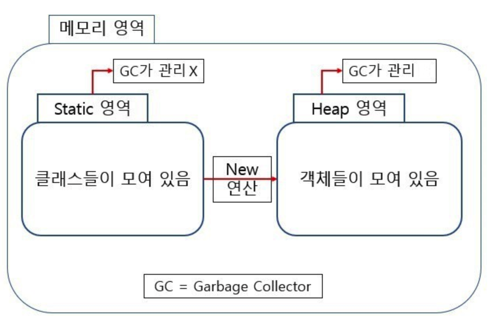

# 정적 변수와 정적 메서드

## 정적 변수와 정적 메서드



 정적 변수와 정적 메서드는 쉽게 말해 프로그램이 실행될 때 메모리에 할당되어 프로그램이 종료될 때 사라지는 멤버 변수나 메서드를 말한다. 

 이로 인해 해당 클래스의 **모든 객체는 해당 멤버 변수나 메서드를 공유하며, 정적 멤버 변수나 정적 메서드는 객체의 생성 없이 접근 가능하다**.

### static 키워드

 타입 스크립트에서는 static키워드를 지원합니다. static키워드는 클래스에 정적 멤버 변수나 정적 메서드 등을 선언할 때 사용할 수 있습니다. 

 정적 메서드나 정적 멤버 변수는 객체의 생성 없이 접근할 수 있고, 이를 모든 해당 클래스의 객체가 공유해 메모리 절약의 효과가 생긴다.

```typescript
class People{
    static greating() {
     console.log("hi");
    } 
}
// 객체를 생성하지 않아도 사용할 수 있다.
People.greating();
```

### readonly 제한자의 활용

 타입스크립트 2.0부터 readonly라는 제한자가 지원됩니다. readonly가 선언된 변수는 초기화되면 재할당 불가능 합니다. 

| 특성 | const | readonly |
| :--- | :--- | :--- |
| **상수 선언** | 가능 | 가능 |
| **초기화 강제성** | 초기화 필수 | 초기화는 선택\(선언만 가능\) |
| **값 재할당** | 불 가능 | 가능 |
| **선언 가능 대상** | 전역 변수, 클래스 메서드의 변수, 함수의 변수 | 인터페이스의 멤버 변수, 클래스의 멤버 변수, 객체 리터럴 속성, 새롭게 정의하는 타입 |
| **선언 불가능 대상** | 인터페이스의 멤버 변수, 클래스의 멤버 변수, 객체 리터럴의 속성  | 전역 변수, 메서드의 변수, 함수의 변수 |
| **사용 용도** | 상수 | 읽기 전용 속성 |
| **컴파일 후 선언의 유지** | 유지됨 | 사라짐 |
| **지원 표준** | ES6 | 타입스크립트2.0 |

